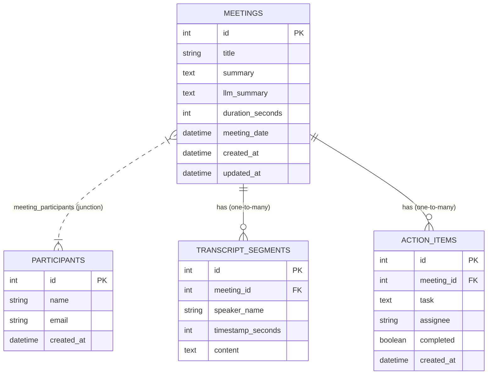

# Meeting Notes Platform

A premium, interactive AI-powered Meeting Notes & Transcription Platform. This platform allows users to upload meeting video recordings (MP4), register attendees, parse transcripts, execute multi-keyword searches, highlight transcripts synchronized with media playback, view dynamic AI-generated summaries, and track actionable tasks.

Built using **Next.js (App Router, Tailwind CSS, Lucide, Sonner)** for a rich, modern dashboard experience, and **FastAPI (SQLAlchemy, SQLite, Pydantic)** for a robust, performant search and analytics API.

---

## 🌟 Features

- **Dashboard & Meetings List**: Real-time listing of meetings sorted by recency. Advanced filtering by participant, date, and time ranges (Today/This Week), with customized clean empty states.
- **Interactive Media Player & Synchronized Transcript**: Play video recordings with dynamic audio-to-text highlighting. Provides a "Sync with Audio" manual synchronization option so scrolling the transcript doesn't hijack user focus automatically.
- **Global Search Overlay (⌘K)**: Instantly search across titles and transcript segments. Aggregates results, displays matching snippet highlights, and filters by host, participant, date range, or sort order.
- **Upload & Automated Parsing**: Upload MP4 recordings (cached locally in browser IndexedDB), configure metadata, parse standard transcript dialogues, and register new attendees automatically. Includes robust inline styling validation.
- **AI Summary & Action Items**: Displays auto-generated meeting summaries (with local simulation fallback) and lists actionable items with checkable state toggling.
- **CRUD Operations**: Support for updating meeting titles and participant lists, or deleting a meeting along with its associated action items and transcripts.

---

## 🛠️ Tech Stack

### Frontend
- **Framework**: Next.js 15 (App Router, React 19)
- **Styling**: Tailwind CSS
- **Icons**: Lucide React
- **Toast Notifications**: Sonner
- **Local Storage**: IndexedDB (for caching large video/audio files)

### Backend
- **Framework**: FastAPI (Python 3.12+)
- **Database**: SQLite (local serverless execution)
- **ORM**: SQLAlchemy
- **Data Validation**: Pydantic v2
- **Query Engine**: Full-Text Search emulation over meeting metadata and transcript segments

---

## 📂 Project Structure

```
meeting-notes-platform/
├── README.md               # Project documentation & ER diagram (this file)
├── be/                     # Backend Python Application
│   ├── app/
│   │   ├── database/       # DB session engine & Base declaration
│   │   ├── models/         # SQLAlchemy database models
│   │   ├── routers/        # FastAPI endpoints (meetings, transcripts, action_items)
│   │   ├── schemas/        # Pydantic schemas for serialization & request validation
│   │   ├── services/       # Business logic implementations (search, summary, CRUD)
│   │   └── main.py         # Application root, CORS settings, & middleware
│   ├── Makefile            # Convenience run/lint commands
│   ├── pyproject.toml      # Poetry / Python packaging settings
│   └── fireflies.db        # SQLite database storage (gitignored)
└── fe/                     # Frontend Next.js Application
    ├── app/                # Next.js App routing pages (dashboard, meetings, uploads)
    ├── components/         # Reusable layouts, search modals, navbar, & sidebar
    ├── lib/                # IndexedDB database helpers & utility files
    ├── package.json        # Frontend scripts & dependencies
    └── tsconfig.json       # TypeScript build rules
```

---

## 📊 Database Schema (ER Diagram)

The following Mermaid diagram outlines the entity-relationship structure of the SQLite database.



---

## 🔌 API Endpoints Reference

### Meetings Endpoints
| Method | Route | Description |
| :--- | :--- | :--- |
| **GET** | `/meetings` | Retrieves meetings list with filters (`search`, `sort`, `date`, `participant`, `time_range`) |
| **GET** | `/meetings/search_global` | Global search aggregating title query match and highlight snippet blocks |
| **GET** | `/meetings/{meeting_id}` | Retrieves detailed record for a specific meeting |
| **POST** | `/meetings` | Creates a new meeting profile |
| **PUT** | `/meetings/{meeting_id}` | Updates metadata or participant bindings |
| **DELETE** | `/meetings/{meeting_id}` | Cascades and deletes the meeting and its dependencies |

### Participant Endpoints
| Method | Route | Description |
| :--- | :--- | :--- |
| **GET** | `/participants` | Fetch list of all registered attendees in the database |
| **POST** | `/participants` | Register a new attendee profile |

### Transcripts Endpoints
| Method | Route | Description |
| :--- | :--- | :--- |
| **GET** | `/meetings/{meeting_id}/transcript` | Fetch segments for a meeting (optional keyword filtering) |
| **POST** | `/meetings/{meeting_id}/transcript` | Batch upload transcript segments |
| **PUT** | `/transcript/{segment_id}` | Update an individual transcript line |
| **DELETE** | `/transcript/{segment_id}` | Delete a transcript line |

### Action Items Endpoints
| Method | Route | Description |
| :--- | :--- | :--- |
| **GET** | `/meetings/{meeting_id}/action-items` | Fetch all actionable tasks for a meeting |
| **POST** | `/meetings/{meeting_id}/action-items` | Add a new task with assignee metadata |
| **PUT** | `/action-items/{action_item_id}` | Toggle checklist status or update task title |
| **DELETE** | `/action-items/{action_item_id}` | Remove a task checklist row |

---

## 🚀 Local Setup Instructions

### Prerequisite Checklist
- **Node.js**: v18.0.0+
- **Python**: v3.12+

### 1. Backend Setup (FastAPI)
Navigate to the `be` directory:
```bash
cd be
```

Create a virtual environment and install dependencies:
```bash
python3 -m venv .venv
source .venv/bin/activate
pip install -r requirements.txt
```
*(Note: If utilizing Poetry or uv, you can simply run `poetry install` or `uv sync` respectively).*

Run the FastAPI application:
```bash
make dev
```
The API server will launch at `http://localhost:8000`. You can inspect the interactive Swagger documentation at `http://localhost:8000/docs`.

### 2. Frontend Setup (Next.js)
Open a new terminal window and navigate to the `fe` directory:
```bash
cd fe
```

Install packages:
```bash
npm install
```

Start the local development server:
```bash
npm run dev
```
Open your browser and head to `http://localhost:3000`.

---

## 🧠 AI Tools, Assumptions & Integrations

- **LLM Summary Generation**: A mock LLM summary handler simulates generating structural meeting summaries and bulleted items upon upload, storing the result dynamically under the `llm_summary` column.
- **IndexedDB Video Storage**: Large video binaries (MP4) are stored directly inside the browser's IndexedDB, avoiding expensive backend storage and enabling instant local playback associated with database-driven meetings.
- **Transcript Format Parsing**: Speaker identification assumes three lines per block (Timestamp `[MM:SS]`, Name, and dialogue content). Incorrect lines are skipped gracefully, with UI validation highlighting errors inline.
- **Manual Audio Sync**: When scrolling away from the current time in the transcripts panel, the UI does not lock back automatically. Instead, a dynamic floating "Sync with Audio" button appears to return the scrollbar seamlessly.